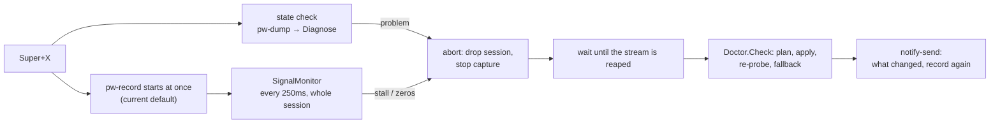

# Mic Self-Check: Detecting and Repairing a Broken PipeWire Mic

Reference for `internal/mic` and its wiring into eager capture (issue 177). Read this before
changing how voxi judges or repairs the input device. Tuning lives in `spec/eager.yaml`
`mic_check`.

## Problem

Switching between Bluetooth headphones and speakers, and carrying the laptop between rooms, often
leaves PipeWire recording from a mic that delivers nothing: a saved default that names a device
that is no longer connected, or a Bluetooth link whose audio transport failed. Eager capture runs
`pw-record` without a target, so it follows whatever the default is and silently records nothing.

## Flow

The fast path is never delayed. The check runs alongside the recording:

The first chunk of a broken session is lost by design; the notification asks the user to press
Super+X again. voxi does not restart or salvage the session.

## Components

| Piece | Role |
| :--- | :--- |
| `mic.ParseDump` | `pw-dump` JSON → `State`: default and saved default source, sources, cards, profiles, active routes |
| `mic.Diagnose` | Pure. Faults visible in the state: `no_default`, `stale_configured`, `bluetooth_no_mic` |
| `mic.SignalMonitor` | Pure. Judges the captured audio: `dead_signal` |
| `mic.Plan` / `mic.Fallback` | Pure. Problems → actions (commands plus the line the user is told) |
| `mic.Doctor` | Probe → diagnose → plan → apply → re-probe until settled → fallback. Host boundary is `Probe` and `Run` |
| `internal/eager/micwatch.go` | Runs the check per session, drops the session, repairs after the reap, notifies |
| `voxi mic [--fix]` | Same diagnosis and repair by hand |

Repairs are deliberately narrow: clear only the saved default source
(`pw-metadata -d 0 default.configured.audio.source`), switch a plain Bluetooth headphone input to
headset mode (`wpctl set-profile`), and fall back to a built-in mic (`wpctl set-default`). No
service restarts and no full WirePlumber state reset, which would forget all volumes and profiles.
A stale saved default alone is not urgent while another mic works.

## Decisions and Pitfalls

- **Bluetooth in A2DP is normal.** WirePlumber 0.5 keeps a loopback input (`bluez5.loopback`)
  for each headset, switches the card to headset mode by itself when something records from it,
  and restores A2DP 2s after the last stream closes (`bluetooth.autoswitch-to-headset-profile`).
  Treating "headphones in A2DP" as broken would abort every headset recording, and a manual
  headset switch does not stick. Only non-loopback Bluetooth inputs get `bluetooth_no_mic`.
- **Repair after the reap.** Applying a change while the broken stream is still open lets
  WirePlumber's restore undo it when the stream closes.
- **Stall, not zeros, is the Bluetooth failure.** Measured live: with a failed transport,
  0.7s of audio arrived in 3s. A working headset emits exact zeros for 1-3s while switching, so
  all-zero audio counts as dead only for built-in mics, which always carry noise.
- **Pick a fallback with an available port.** WirePlumber ignores a saved default whose input
  route is unavailable (seen with Mic2 on the T14), so the fallback picks the non-Bluetooth source
  with an available input route and the highest route priority.
- **Session ends itself.** The drain is abandoned with drop reason `mic_repaired` and
  `eagerSessionManager.StopSession` clears the daemon state only if that session is still active.
  The agent's cached recording state is re-checked against the daemon on status.

## Known Limits

- If 10 utterances queue behind transcription, capture reads block and could look like a stall.
  Not seen live.
- A deliberately muted built-in mic is reported as "delivers no audio" and the recording stops.
- Only tested with one Bluetooth headset ("Der Kopfhörer"); speakers are never switched to headset
  mode (`device.form-factor` must be a headphone type).
