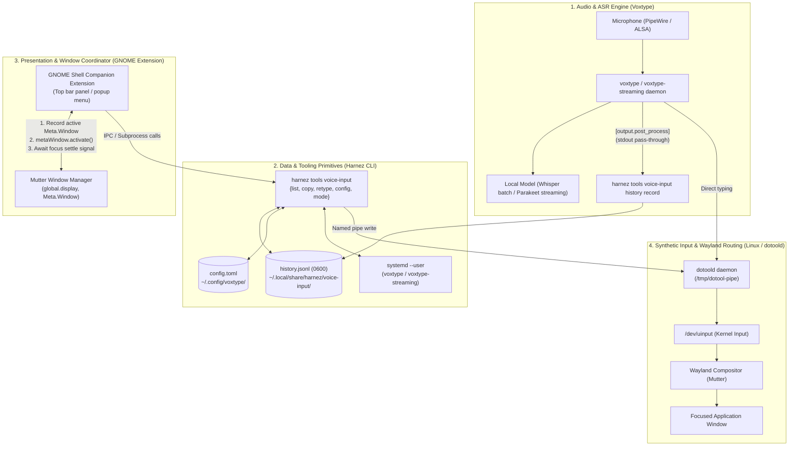

# ADR: Voice Input Desktop Companion & Wayland Input Architecture

- **Status**: Accepted
- **Date**: 2026-08-18
- **Context**: [Issue 020 (OS Tools Voice Input)](../issues/020-tools-command-os-tools.md), [Issue 021 (Fluent Streaming Typing)](../issues/021-fluent-streaming-typing.md), [Issue 022 (GNOME Transcriber UI)](../issues/022-gnome-transcriber-ui.md)
- **Primary Reference**: [docs/VoiceInput.md](VoiceInput.md)

---

## 1. Context & Problem Statement

Headless voice dictation on Linux/Wayland (via Voxtype + `dotoold`) provides zero-overhead speech-to-text. However, a desktop companion UI (such as a GNOME Shell extension panel) is needed to give users visibility into recent dictations, one-click clipboard copying, typing-speed adjustments, and history retyping.

Integrating a GUI into a Wayland-based typing pipeline introduces architectural challenges:
1. **Focus Stealing & Retype Races**: Opening an extension popup steals input focus. Retyping previously transcribed text into the target application requires transferring focus back before injecting keystrokes. Naive fixed delays (`sleep`) fail unpredictably across varying system loads.
2. **Upstream Decoupling**: Dictation history must be captured reliably without requiring custom forks or intrusive patches to Voxtype.
3. **Privilege & Security Boundaries**: Synthesizing keystrokes via `/dev/uinput` requires careful isolation. The companion UI must not introduce standing privilege escalations (such as permanent `input` group membership) or bypass local permission boundaries.

---

## 2. Decision: 4-Tier Decoupled Architecture

We adopt a modular, 4-tier architecture where each layer has a single, strictly bounded responsibility:



---

## 3. Component Responsibilities Matrix

| Layer / Component | Primary Responsibility | Explicit Non-Goals / Exclusions |
| :--- | :--- | :--- |
| **1. Voxtype** (`systemd --user`) | • Audio capture via ALSA/PipeWire<br>• Local offline ASR (Whisper / Parakeet)<br>• Invokes `[output.post_process]` hook<br>• Primary live dictation typing | • No GUI or history buffering<br>• No window focus tracking<br>• No clipboard management |
| **2. Harnez CLI** (`internal/tools`) | • Local history store (`history.jsonl`, `0600`)<br>• Zero-overhead `record` filter (`cat` wrapper)<br>• Comment-preserving `config.toml` editor<br>• Standalone `retype` and `copy` CLI commands | • No persistent GUI of its own<br>• No compositor-internal window queries |
| **3. GNOME Extension** (GJS / Shell) | • Top bar status icon and history popup<br>• History list presentation<br>• Mode toggle (batch vs. streaming)<br>• Typing speed slider (`type_delay_ms`)<br>• **Mutter focus capture and restoration** | • Does not synthesize keystrokes directly<br>• Does not manage audio streams or models |
| **4. Mutter & Wayland** | • Window focus management and input routing<br>• Global shortcut handling (`Super+X`)<br>• Emits compositor focus signals to GJS | • Agnostic to speech and transcript content |
| **5. `dotoold` & `/dev/uinput`** | • Kernel-level synthetic keystroke injection<br>• XKB layout translation (`de`/`us`)<br>• Ultra-low latency (<10ms) via named pipe | • No window targeting (types to active surface) |

---

## 4. Key Architectural Patterns & Decisions

### 4.1. Zero-Intrusion History Capture via `[output.post_process]`
Voxtype provides a hook `[output.post_process]` that passes transcribed text on `stdin` and reads final text from `stdout`.

- `harnez tools voice-input history record` acts as a pass-through filter (a recording `cat`).
- It parses `stdin`, computes a short hash ID (`historyID`), writes to `~/.local/share/harnez/voice-input/history.jsonl` (mode `0600`, capped at 20 entries), and immediately writes the unchanged text to `stdout`.
- **Consequence**: Full history capture is achieved with zero upstream changes to Voxtype.

### 4.2. Safe Window Focus Restoration for Retype (Mutter Signal Handshake)
Typing into the background application from the extension menu requires eliminating focus races:

1. **Capture on Open**: When the user opens the extension menu, the extension queries Mutter:
   ```javascript
   const targetWindow = global.display.get_focus_window();
   ```
2. **Close & Activate**: When the user clicks "Retype" on an entry:
   - The extension menu closes.
   - The extension calls `targetWindow.activate(global.get_current_time())`.
3. **Signal Settle**: The extension attaches to the window focus event (e.g. `notify::has-pointer-focus` or Mutter's focus-changed signal).
4. **Trigger Injection**: Only after Mutter confirms the target window has regained active focus does the extension invoke `harnez tools voice-input history retype <ID>`.
5. **Fallback Safety**: If `targetWindow` is closed or destroyed while the menu was open, the retype action aborts safely rather than injecting keystrokes into an arbitrary window.

### 4.3. Atomic, Comment-Preserving Configuration Editing
Voxtype's built-in `voxtype config set` CLI only supports changing the `engine` key and omits `type_delay_ms`.

- Harnez implements a targeted regex line editor (`SetTypeDelayMs` in `internal/tools/voice_config.go`) that edits only `type_delay_ms` in-place, preserving comments and formatting.
- Changes are written atomically via temp-file creation and rename (`writeConfigAtomic`).

### 4.4. Development & Testing Workflow (GNOME 45–50 Devkit / Nested Sessions)
Developing and testing GNOME Shell extensions without logging out:

- **Canary Tooling** (`scripts/canary_nested/main.go` & `scripts/canary_ext/main.go`):
  - Validates headless Wayland display socket creation (`dbus-run-session gnome-shell --devkit --wayland`), child process-group termination, and `dotoold` keystroke injection (`Ctrl+S` saving / `Ctrl+Q` exit).
- **GNOME 50 Finding**:
  - In GNOME 50 (Wayland-only), `--nested` is superseded by `--devkit`.
  - On platforms where the separate `mutter-devkit` helper (`/usr/libexec/mutter-devkit`) is not yet packaged, `gnome-shell --devkit` runs headlessly without rendering a graphical window or initializing the extension manager for user extensions.
  - On GNOME 45–48 with full nested support or GNOME 50 with `mutter-devkit`, symlinking the extension into `~/.local/share/gnome-shell/extensions/<uuid>` enables live testing without host session restarts.

---

## 5. Security & Privacy Considerations

1. **Local-Only Sensitive Data**: Voice dictations may contain sensitive tokens, passwords, or personal communications. History is stored strictly in `~/.local/share/harnez/voice-input/history.jsonl` with `0600` permissions. No network sync or background indexing is performed.
2. **Instant History Erasure**: `harnez tools voice-input history clear` allows immediate one-click deletion of stored transcripts.
3. **No Added Privileges**: Input injection uses the existing user-session `/dev/uinput` access (`uaccess` tag). No root escalation or `input` group membership is requested or required.

